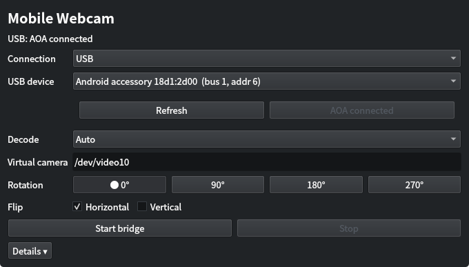

# Mobile Webcam



*Current AppImage screenshot: Xperia connected through USB AOA.*

Use an Android phone as a Linux webcam over USB or local Wi-Fi. The Linux side
outputs a normal V4L2 camera such as `/dev/video10`, so camera applications do
not need a Mobile Webcam plugin.

**Languages:** English and Japanese. The app follows the system language and
uses English when no Japanese locale is selected.

## What it does

- Streams Android Camera2 video through MediaCodec H.264.
- Supports USB Android Open Accessory and Wi-Fi/LAN.
- Uses VAAPI, CUDA, or software decoding on Linux.
- Corrects the default horizontal mirror and supports live 0°/90°/180°/270°
  rotation plus vertical flip.
- Applies orientation changes without reopening the camera application.
- Ships a Qt 6 GUI and an x86_64 AppImage.

## Quick start

### Use a release

1. Install the APK on Android and download the x86_64 AppImage from the
   project's [Releases](https://github.com/nekomario28/mobile-webcam-bridge/releases).
2. Install the two Linux runtime requirements: `libusb-1.0` and the
   `v4l2loopback` kernel module. Package names for common distributions are:

   ```sh
   # Arch / CachyOS
   sudo pacman -S --needed libusb v4l2loopback-dkms

   # Ubuntu / Debian
   sudo apt update
   sudo apt install libusb-1.0-0 v4l2loopback-dkms

   # Fedora: run after enabling RPM Fusion Free
   sudo dnf install libusb1 v4l2loopback
   ```

   Fedora needs [RPM Fusion Free](https://rpmfusion.org/Configuration) for
   `v4l2loopback`. Other distributions need the equivalent runtime packages.

3. Make the AppImage executable and start it:

   ```sh
   chmod +x Mobile_Webcam-0.1.1-x86_64.AppImage
   ./Mobile_Webcam-0.1.1-x86_64.AppImage
   ```

4. Choose **USB** or **Wi-Fi** in the Linux GUI, then start the camera on
   Android. The AppImage includes the bridge, decoder, and GUI; it does not
   include the Linux kernel module.

If `/dev/video10` is missing, or USB access fails without sudo, clone this
repository and run the following once. Skip it when an existing `v4l2loopback`
device is already usable; select that `/dev/videoX` in the GUI if necessary.

```sh
sudo ./linux/install-host-integration.sh
sudo modprobe v4l2loopback
```

The script is a one-time permission and device-name setup. It is not needed
each time the AppImage starts.

### Build from source

Install the equivalent development packages for your distribution: CMake 3.20+,
a C++20 compiler, pkg-config, libusb-1.0 development files, FFmpeg
`libavcodec`/`libavutil`/`libswscale` development files, Qt 6 Widgets 6.5+,
and `v4l2loopback`. Then run:

```sh
cmake -S host -B build/host -DCMAKE_BUILD_TYPE=Release -DAMB_BUILD_GUI=ON
cmake --build build/host --parallel
ctest --test-dir build/host --output-on-failure
./linux/build-appimage.sh
```

The generated file is `dist/Mobile_Webcam-<version>-x86_64.AppImage`.

## USB

1. Open Mobile Webcam on the phone and connect the USB cable.
2. In the Linux GUI, select **USB** and press **Switch to AOA** if the phone
   is still shown as a Sony device.
3. Press **Start bridge** on Linux, then **Start camera** on the phone.

The normal streaming target is accessory-only `18d1:2d00`; USB debugging is not
needed for the running camera connection.

For the equivalent terminal flow:

```fish
./build/host/amb-aoa-probe --list
sudo ./build/host/amb-aoa-probe --device 0fce:XXXX --switch
./build/host/amb-v4l2-sink --device /dev/video10 --hw-decode auto
```

## Wi-Fi

1. Press **Connect Wi-Fi** in the Android app.
2. Enter the phone's displayed IPv4 address in the Linux GUI.
3. Press **Start bridge**, then **Start camera** on the phone.

There is no PIN. The current LAN transport has no authentication or encryption,
so use it on a trusted local network. Only one LAN client is accepted.

The terminal equivalent is:

```fish
./build/host/amb-v4l2-sink \
  --lan 192.168.1.42 \
  --device /dev/video10 \
  --hw-decode auto
```

## Controls

The GUI starts with horizontal mirror correction enabled. Rotation is clockwise;
90° and 270° are fitted into the existing V4L2 size with black sidebars.
Horizontal and vertical flip can be changed independently while streaming.

## Architecture

```text
Android Camera2 -> MediaCodec H.264 -> AMB1 frames -> USB or Wi-Fi
                                      -> Linux decode -> V4L2 /dev/videoX
```

USB and Wi-Fi share the same framed H.264 session, decoder, recovery, transform,
and V4L2 path. The AMB1 wire format and `amb-*` helper names are internal
identifiers retained for compatibility.

## Status

v0.1.1 is available for Android and x86_64 Linux. USB has been tested with a
Sony Xperia XQ-GE44 with USB debugging off. Wi-Fi is implemented; long-running,
reconnect, and camera-application compatibility checks are still pending.

Technical details and test records are in [`docs/architecture.md`](docs/architecture.md),
[`docs/gates.md`](docs/gates.md), and [`docs/evidence/`](docs/evidence/).

## License

Mobile Webcam source, scripts, and documentation are MIT licensed. The
AppImage also contains Qt and FFmpeg components under their upstream licenses;
`libusb` and `v4l2loopback` are separate dependencies. See
[`LICENSE`](LICENSE), [`THIRD_PARTY_NOTICES.md`](THIRD_PARTY_NOTICES.md), and
[`linux/APPIMAGE_LICENSES.md`](linux/APPIMAGE_LICENSES.md).
