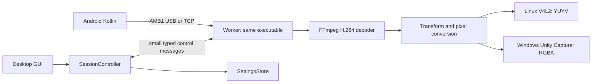

# Mobile Webcam — Rust host design

Status: DESIGNED. Last updated: 2026-10-04 (Asia/Tokyo). Implementation: NOT RUN.

## Next Agent Prompt

Read [contracts.md](contracts.md) and [research.md](research.md), then start [01-dependencies](slices/01-dependencies.md) when implementation is requested. The baseline is `v0.1.2`, commit `03e874d7396f1160f73087d657847760226199bb`, refreshed against origin/main on 2026-10-04. Refresh origin/main before implementation; if production has moved, reconcile its behavior with this frozen baseline before editing. This local design branch is `rust-host-design`; main and the release are unchanged. Record exact dependency versions and actual measurements before marking any implementation slice accepted. Native Windows hardware, a minimal FFmpeg build, and Rust GUI parity remain NOT RUN. Update this handoff and the checklist before ending each implementation pass.

- [ ] [01 — Minimal FFmpeg and build closure](slices/01-dependencies.md)
- [ ] [02 — Native GUI and existing saved settings](slices/02-gui-settings.md)
- [ ] [03 — AMB1 and TCP compatibility](slices/03-wire-tcp.md)
- [ ] [04 — Decode, transforms, and Linux camera](slices/04-linux-video.md)
- [ ] [05 — Windows camera and stop behavior](slices/05-windows-video.md)
- [ ] [06 — USB AOA and selected-device continuity](slices/06-usb.md)
- [ ] [07 — GUI integration, packaging, and parity release](slices/07-integration-release.md)

## Scope

PC host: Rust, replacement of Qt, a purpose-built FFmpeg decoder runtime, a shared USB/TCP session, persisted settings, and existing packaging integration. Android remains Kotlin and the released APK continues to work. iOS/WebRTC and automatic Wi-Fi discovery are subsequent features; their boundaries are recorded without adding unused implementations now.

## Proposed structure

One Cargo package at `host-rs/`. Windows ships one application executable: its normal entry opens the GUI, and a private mode runs a receiving worker. Linux uses the same arrangement plus a small USB-only executable for the existing AOA elevation boundary; it does not link GUI or codec dependencies. Retain the existing one-time setup script. A receiving worker exists only while connecting or receiving. No service or resident daemon.

| Owner | Responsibility |
|---|---|
| `gui` | Form, keyboard interaction, localization, and rendering immutable session observations |
| `session` | User intent, worker/helper lifetime, authoritative visible state, bounded stop |
| `settings` | Read/write the existing native settings store; no second store in the worker |
| `wire`, `transport` | AMB1 framing; USB-specific transfer discipline or TCP sockets |
| `video` | Packet/decoder lifetime, protocol start conditions, transformation, reusable pixel buffers |
| `output` | Linux V4L2 or pinned Unity Capture IPC; output resources never enter the GUI |
| `integration` | One-time host setup and package operations, outside the per-frame path |

Use modules, not a collection of local crates or plugin interfaces. Unsafe code is confined to FFmpeg and OS/USB boundaries. The worker owns transport, decoder, transforms, and camera handles for one session.

## Dependency decisions

| Component | Initial choice | Reason and exit condition |
|---|---|---|
| GUI | `egui` / `eframe`, one `wgpu` renderer, Windows and Linux X11/Wayland | MIT/Apache ecosystem, no Qt. Slice 02 must establish Japanese input, accessibility, startup, idle repaint behavior, and packaged size; reopen only on a concrete failure |
| Video | `ffmpeg-next`, defaults disabled; `codec` and `software-scaling` | Retain mature H.264 and GPU decoding. Test its exact version against minimal FFmpeg in slice 01; use its `ffi` access only inside `video` for hardware contexts |
| USB | `rusb` / libusb | Preserve the current AOA behavior and device selection. nusb is deferred: ~0.24 MiB Windows library saving does not justify combining a USB backend change with the initial port |
| IPC | `serde` / `serde_json` | Small bounded private control messages between the same executable; no version negotiation |
| Settings | Existing Linux INI / Windows registry | Keep Qt-compatible keys/types without Qt; saved IP also remains usable on rollback |
| OS | `windows` or `windows-sys` on Windows; libc/ioctl bindings on Linux | Target-specific APIs, not an additional camera framework |

Pin released crates and the Rust toolchain during slices 01/02; commit `Cargo.lock`. Feature lists must be verified against that release, not copied from upstream main. Keep accessibility, system fonts, X11/Wayland; avoid an HTTP client, WebView, second renderer, video preview, and async runtime unless a current behavior needs one.

FFmpeg retains `avcodec`, `avutil`, `swscale`, H.264 decoding and the matching GPU paths: Linux VAAPI/CUDA, Windows D3D11VA/CUDA, plus software fallback for `auto`. Explicit backend selection fails visibly if unavailable. Disable automatic external-library discovery, encoders, unrelated codecs, audio, SVG, demuxers/muxers, network protocols, programs, and documentation. Resolve exact hardware configure names from the pinned FFmpeg source in slice 01. Start with the baseline's FFmpeg revisions and Windows GNU/MinGW ABI; an MSVC switch or cross-platform version consolidation needs a separate measured reason. Linux's packaged glibc and CPU requirements must not become stricter than the baseline.

## UX contract

- Launch restores connection mode, last Wi-Fi address, decode choice, output, rotation, and flips. It does not start the phone camera or connect automatically.
- Main surface: USB / Wi-Fi selector, one device/address field, current status, and one Connect / Cancel / Stop action. Cancellation remains available during setup/connect, and Stop remains available while waiting or receiving.
- A valid Wi-Fi address is reused on every launch. Edits are saved after a short debounce and on action/close; saving does not depend on successful connection.
- USB: selecting the single compatible phone and connecting performs the AOA transition. Multiple candidates require a choice; unrelated USB devices are not probed with vendor requests.
- Status distinguishes connecting, waiting for the phone camera, waiting for a Windows consumer, frames submitted to the camera, and failure. Show the next useful action in Japanese/English; errors remain inspectable in a bounded expandable log.
- Existing Android Start/Stop operation remains necessary. A TCP reconnect does not itself restart the Android camera. Initial Rust release offers an explicit reconnect action retaining the endpoint; autonomous retry/discovery is deferred.
- Rotation, flips, decode, and Linux output are in Details. No default video preview or per-frame GUI updates.
- Windows keeps one Setup.exe that installs the app/runtime/filter and creates shortcuts. Linux bundles runtime and offers the existing one-time setup action when required. Neither platform asks release users to install Cargo or build dependencies.

## Release and evidence rules

The required parity matrix is in [contracts.md](contracts.md). Keep the C++ host usable during the port; the Rust build is selected explicitly on the branch, with no production C++/Rust fallback dispatcher. On accepted cutover, ship only the Rust host and remove the old host targets/GUI/helpers in slice 07. Git tags retain the rollback baseline and the shared native settings retain the user's values. The pinned external camera filter is retained, not copied into a new camera project.

Initial size target: expanded Windows/Linux distribution **at most 60 MiB each**, measured with the same counting method as the baseline. This is a provisional design objective, not a proven result; slices 01/02 must record an achievable budget before deeper porting. No Qt or unrelated codec dependency closure may remain. Count build crates, shipped libraries, byte sizes, and user-installed prerequisites separately. Never reinterpret a reduced DLL count as zero dependencies.

Preserve [G0–G3](../../docs/gates.md), including 1000 USB integrity exchanges, 720p30 for 10 minutes, 1080p30 for 30 minutes, and real consumer checks. G4/1080p60 remains gated. Wine is supplementary IPC/installer evidence, not native Windows acceptance. Static checks do not establish phone/GPU/camera behavior. Missing hardware does not become a passing gate.

Native visual slices require an unprimed `screenshot-critique` as the last visual acceptance check. When comparing a candidate to baseline/prototype, also use `compare-screenshots`; judge the stated variable rather than exact pixel equality. Review surfaces are offered without introducing a new permission gate for reversible work.

## Later features

iOS: HTTPS Safari capture and a WebRTC receiver feeding the existing decoded-frame/transform boundary. Do not route a browser through AMB1 TCP or AOA. Trusted HTTPS setup, signaling, pairing, browser lifecycle, and receiver-library choice require their own first useful spike; no cloud account or certificate procedure is assumed solved.

Wi-Fi discovery: Android NSD advertisement plus host DNS-SD lookup, while retaining manual/saved addresses for existing APKs. Implement only after Rust parity. Endpoint discovery is not authentication or proof of phone identity.

## Current evidence and unknowns

- Existing code is C++20 / Qt Widgets / libusb / FFmpeg. Android uses Camera2 / MediaCodec and AMB1.
- v0.1.2 distribution audit: Windows staging 184.0 MiB, Linux AppDir 182.8 MiB. Qt-exclusive libraries: 63.2 / 69.4 MiB. FFmpeg-exclusive non-core libraries: 84.5 / 84.6 MiB. These are removal candidates before replacement code, not final Rust binary sizes.
- Existing AMB1 and USB transfer boundaries must survive the rewrite. Read/write the same native QSettings store without Qt so the user does not need to re-enter the IP.
- Rust host, minimal FFmpeg, Rust GUI, and new device/consumer checks: NOT RUN.

## Next safe action

Start slice 01 once implementation is requested. The first useful native checkpoint is slice 02: a small GUI that remembers the existing address and lets the user inspect all session states. Advance to camera tests only after binding/build and GUI assumptions have measured evidence. See the [Japanese design overview](design-ja.md), [interactive UI sketch](visualizations/ui.html), and [sketch review boundary](ui-review.md) for review.
