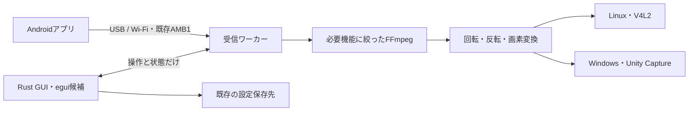

# Mobile Webcam：Rust版PCホストの設計

2026-10-04。設計を `rust-host-design` ブランチに保存。基準は v0.1.2 / `03e874d7396f1160f73087d657847760226199bb`。Rust実装・新しい実機試験はまだ行っていない。

**PC側をRustへ置き換える。AndroidはKotlin、映像デコードはFFmpeg、USBはlibusb、仮想カメラは現在の方式を維持する。** 大きな削減対象はQtと、現在のFFmpeg配布物に含まれる不要なライブラリ群。

## 構成

Windowsでは1本のアプリexeをGUIとして起動し、接続時だけ同じexeを受信ワーカーとして起動する。映像が詰まってもGUIから停止できるようにする。GUIへ映像を渡す処理は作らない。

Linuxは同じ構成に、小さなUSB権限用ヘルパーを加える。権限を上げるのは選択した電話のAOA切替だけで、受信とGUIは通常ユーザーで動かす。既存の初回設定スクリプトを再利用する。

| 項目 | 設計上の選択 |
|---|---|
| GUI | egui/eframeを候補にする。日本語入力・アクセシビリティ・起動・待機負荷・配布サイズを実測して確定 |
| デコード | FFmpegのH.264と既存GPU経路を残し、avcodec/avutil/swscale中心にビルド |
| USB | rusb/libusbで既存AOAを維持。USBデバッグOFF・既存APKとの互換を検証 |
| 設定 | Linux INI / Windowsレジストリの既存保存先をQtなしで読み書き |
| Windows配布 | Setup.exe 1本。内部の必要DLLと既存カメラフィルターはインストーラーが扱う |
| Linux配布 | AppImageと既存の初回設定。v4l2loopbackはOS側の依存として残る |

## 操作を減らす

- 起動すると、前回の接続方式・Wi-FiのIP・回転・反転・デコード設定を復元する。IPの保存は接続成功に依存しない。
- 主画面は接続方式、電話またはIP、状態、接続／取消／停止ボタン。回転・反転・デコードは「詳細」に置く。
- USBは選択した電話のAOA切替から受信まで、PC側の接続ボタンで進める。複数台ある場合だけ選択が必要。
- 接続できた状態、スマホのカメラ開始待ち、Windowsのカメラ使用アプリ待ち、仮想カメラへの送信を区別する。
- Wi-Fi切断後は保存済みIPで再接続できる。現行Androidは切断時にカメラを停止するため、スマホ側の開始操作も必要。
- 使用アプリがWindowsカメラを開いていない間は、現行同様に画素変換・出力を省く。待機中の常時再描画や映像プレビューを増やさない。

[操作できるUI案](visualizations/ui.html)は画面と状態遷移の検討用。実機通信やカメラ出力は行わない。ブラウザ内のサンプルIP保存と、製品の既存設定保存は別。

## 実装順序と合格条件

| 段階 | 完成させるもの | 判断に必要な確認 |
|---|---|---|
| [01](slices/01-dependencies.md) | 最小FFmpegとRustバインディング | 同じH.264を復号、GPU機能を維持、配布依存とサイズを記録 |
| [02](slices/02-gui-settings.md) | GUIと設定保存 | 旧版→Rust→旧版でIPが保持され、日本語入力・再起動・保存失敗を確認 |
| [03](slices/03-wire-tcp.md) | AMB1/TCP受信と停止 | 既存APKの通信形式、断片受信、異常入力、停止・親終了・再起動を確認 |
| [04](slices/04-linux-video.md) | 共通映像処理とLinux出力 | 回転・反転・画素・GPU・実際のV4L2利用を確認 |
| [05](slices/05-windows-video.md) | Windowsカメラ出力 | 既存フィルターとのIPC一致、停止、実Windowsの利用アプリを確認 |
| [06](slices/06-usb.md) | USB経路 | 同じ電話をAOA後も追跡し、デバッグOFFで1000往復と切断・取消を確認 |
| [07](slices/07-integration-release.md) | 完成GUI・配布・切替 | Setup/AppImageを実際に起動、旧版更新・削除、既存の連続映像ゲートを確認 |

最初に触れる成果は02の「前回のIPを復元するRust GUI」。実機がなくても設定互換とUI採用判断を先に進められる。カメラ出力の合格とは分けて扱う。

## 削減の見込みと限界

現行の展開後サイズはWindows 184.0 MiB、Linux 182.8 MiB。Qt専用分と不要候補のFFmpeg依存は合計約148 / 154 MiBあるが、置き換えるGUI・Rustバイナリなどの費用が加わる。完成サイズはまだ測定できていない。

初期の設計目標は展開後60 MiB以内。01/02で成立する予算を実測して判断し、単にRustにしただけで達成したとは扱わない。Rustのビルド用crate、配布するDLL/SO、利用者がOSに導入するものを別々に数える。

FFmpeg・libusb・GPUドライバー・仮想カメラは残る。Windowsの電話側USBドライバー適合、Linuxのカーネルモジュール導入もRust化だけではなくならない。単一Setup.exeが配布・起動の入口になる。

## iOSとWi-Fi自動検出

iOSは後続の設計で、SafariのHTTPSカメラ取得とWebRTCを使う入力経路を追加する。既存のUSB/TCPプロトコルをブラウザへ流用せず、受信した映像を共通の変換・カメラ出力へ渡す。HTTPSの信頼設定とペアリングを含め、スマホで最初に映像を送れる試作から判断する。

Wi-Fi自動検出はAndroid NSDとホストDNS-SDを候補にする。まず既存APK・保存済みIPでRust版を完成させ、自動検出は別の変更にする。

## 切替と次の作業

実装中は現在のC++版を維持する。Rustの各段階を別ブランチで検証し、両OSの必要ゲートを満たしてから配布入口を切り替える。完成時には古いQt版ターゲット・ヘルパーを除去し、アプリ内の新旧切替機構は残さない。旧タグと共有の設定保存先で戻せるようにする。

次は01の依存構成の試作。[詳細契約](contracts.md)、[根拠とレビュー結果](research.md)、[継続用のチェックリスト](README.md)に実装時の判断条件を残してある。
