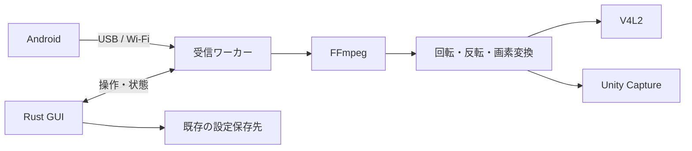

# Mobile Webcam：Rust版の設計

PCはRust、GUIはegui候補。AndroidはKotlinのまま、既存APK・FFmpeg・libusb・仮想カメラ方式を維持する。

主画面は **USB / Wi-Fi、接続ボタン**。Wi-FiはIP、USBは複数台のときだけスマホの選択欄を出す。

- Androidはメーカーで限定しない。USBは1台なら自動選択、0台なら接続を案内。
- EN/JAは端末の言語から自動選択。画面案はブラウザの言語に従う。
- 前回の接続先を復元。保存・復元の成功通知は出さない。
- 状態は短く。待ち・エラー時は次の操作を示す。
- ボタンは接続／取消／停止に切り替わる。
- 回転・反転・デコード・ログは「詳細」へ。
- 受信は別プロセスにし、詰まってもGUIから停止できる。

[操作できる画面案](visualizations/ui.html)。通信は行わない。

| 配布・依存 | 方針 |
|---|---|
| Windows | Setup.exe一本。同じアプリexeがGUIと受信を担当 |
| Linux | AppImage。USB切替用の小さな権限ヘルパーと既存の初回設定を利用 |
| 設定 | 既存のLinux INI / WindowsレジストリをQtなしで読み書き |
| 削減 | Qtと不要なFFmpeg機能・依存を除く。展開後60 MiB以内は仮目標 |
| iOS | 後続でHTTPS/WebRTC入力を追加 |

実装順は **最小FFmpeg → GUI・設定 → TCP → Linux映像 → Windowsカメラ → USB → 配布**。

最初のUI成果は「前回のIPを復元するRust GUI」。既存の実機ゲートを満たしてから配布を切り替える。Rust版は未実装。

[実装計画](README.md) · [詳細契約](contracts.md) · [根拠](research.md)
